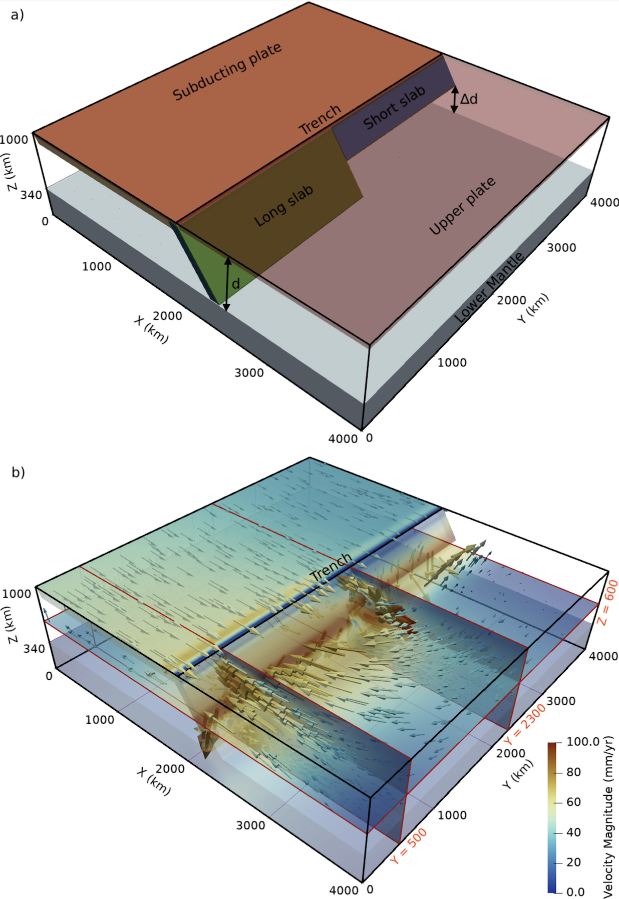

# HPC for understanding large earthquakes

**This study has been published in a Tier-1 peer reviewed journal**, which can be accessed here: https://agupubs.onlinelibrary.wiley.com/doi/full/10.1029/2022TC007242

This project examines the conditions for big earthquakes through 3D numerical modelling, exploring the trend of spatial stress distribution by testing different physics-based models. Using HPC, NumPy, and data visualization, the project sheds insights into how stresses that emerge from the far regions (up to ~1000 km) may cause big earthquakes in some countries, like Indonesia, forecasting potential regions at risk and controlling factors.

-----------

## Model setup

